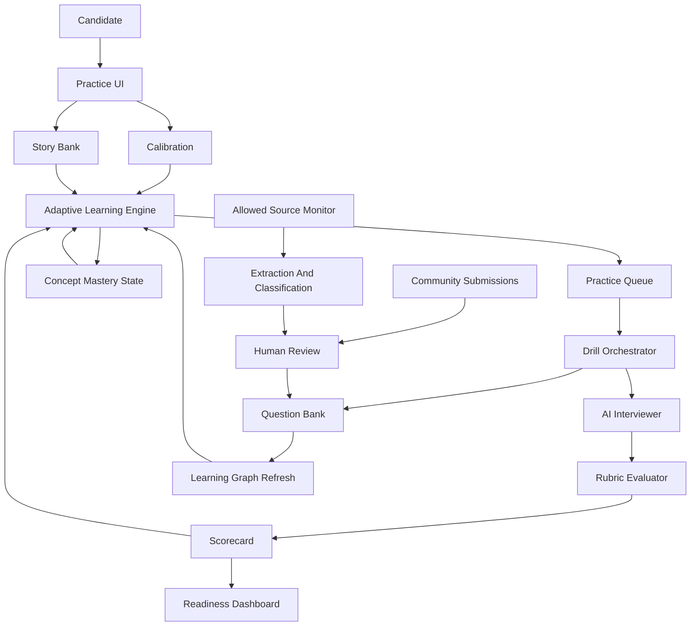

# PrepOS

Open-source PM interview practice for candidates preparing for product, AI product, and senior product loops.

PrepOS is designed around one promise:

> Know what to practice next, not just what question to answer.

Most PM prep tools help candidates collect questions, watch examples, or book mocks. PrepOS should help candidates build interview reps, get transparent feedback, and turn weak answers into stronger next attempts.

## Status

MVP1 development has started.

Implemented now:

- local Next.js app
- calibration by target level, company style, date, and weak area
- candidate-selected practice categories
- adaptive practice queue
- adaptive learning support: Coach, Guided Practice, Light Feedback, Interview Practice, Maintenance
- concept mastery tracking
- answer scorecard
- source-aware seed question bank
- weekly self-update workflow for reviewed question submissions

The first public version should stay small, useful, honest, and fast to ship.

Do not claim fake traction. Do not claim a question was asked at a company unless the source is clear. Do not scrape sources that disallow automated access.

## Run MVP1

Live site:

https://hellopriyankapm-dotcom.github.io/PM-Interview-PrepOS/

```bash
npm install
npm run dev
```

Open http://localhost:3000.

Useful checks:

```bash
npm run validate:content
npm run build
npm audit --audit-level=moderate
```

### Self-promo slot & email capture

PrepOS ships with a single reusable promo card that can appear on the landing
page and at the top of the practice-app sidebar. It captures email addresses
via a JSON POST to a configurable endpoint — no PrepOS backend needed.

**Disabled by default.** To enable, copy `.env.example` to `.env.local` and:

1. Sign up for [Formspree](https://formspree.io) (free tier: 50 submissions/month).
2. Create a new form and copy the form ID.
3. Set:
   ```
   NEXT_PUBLIC_PROMO_ENABLED=true
   NEXT_PUBLIC_PROMO_FORM_ENDPOINT=https://formspree.io/f/<your-form-id>
   ```

Submissions arrive in your email inbox and in the Formspree dashboard
(exportable as CSV). The `source` field on each submission tells you whether
the signup came from the landing page (`prepos-landing`) or the in-app
sidebar (`prepos-sidebar`).

**Swapping providers** — point `NEXT_PUBLIC_PROMO_FORM_ENDPOINT` at any URL
that accepts a JSON `POST { email, source }` and returns 2xx. Buttondown,
ConvertKit forms, and Airtable forms are all compatible.

**Resetting dismissals** for a relaunch — bump `dismissKey` in `lib/promo.ts`
from `prepos-promo-dismissed-v1` to `-v2`.

GitHub Pages deploys automatically from `main` using `.github/workflows/deploy-pages.yml`.

## Why This Should Exist

PM interviews are broad and stressful. Candidates are expected to handle product sense, execution, metrics, strategy, behavioral stories, technical collaboration, stakeholder trade-offs, and increasingly AI product judgment.

Existing products are useful, but the market still leaves room for a candidate-loved tool:

| Candidate Need | Current Market | PrepOS Opportunity |
|---|---|---|
| Realistic practice | Exponent offers peer mock interviews and AI feedback for some roles. | Always-available AI drill sessions with transparent rubrics. |
| Large question banks | PMExercises has 3,000+ questions, answers, coaching, and community. | Smaller, cleaner, cited question bank plus reusable practice loops. |
| Structured frameworks | RocketBlocks and Product Alliance have strong courses and example answers. | Open-source rubrics that candidates can inspect, fork, and improve. |
| AI-era PM prep | AI PM content exists, but it is scattered. | Dedicated AI product judgment drills: evals, failure modes, trust, safety, cost, latency, and launch readiness. |
| Personal prep system | Candidates often track stories and practice in scattered docs. | One workspace for questions, answers, transcripts, scorecards, and story bank. |

## Launch Wedge

Start with one narrow product:

**A free AI PM interview drill room with brutally useful feedback.**

The candidate chooses a round, target level, and company style. PrepOS asks one prompt, pushes back with follow-ups, times the answer, then scores the transcript with an open rubric and gives the candidate one focused next rep.

The first version should feel like:

1. Pick a round.
2. Answer out loud or in text.
3. Get a scorecard.
4. See the one habit that would improve the answer most.
5. Try again immediately.

Practice categories:

- Product sense
- Execution and metrics
- Analytics and experimentation
- Strategy
- Behavioral and leadership
- AI product judgment
- Technical collaboration
- Estimation and prioritization

## Adaptive Learning Goal

PrepOS should optimize for speed to interview readiness, not content completion.

The candidate enters:

- target role: APM, PM, Senior PM, Staff/Group PM, AI PM, PM-T
- target companies or company style
- interview date or desired timeline
- current experience level
- available weekly practice time

PrepOS then creates a prep plan that changes after every drill. If a candidate is already strong in product sense but weak in metrics, PrepOS should stop wasting time on product sense and push metrics, execution, and concise decision-making until the gap closes.

The system should always answer:

- What level is the candidate targeting?
- What is the expected bar for that level?
- What evidence do we have from their answers?
- What is the fastest next practice rep?
- What can be skipped because it is already strong enough?

PrepOS should also adapt how much support it gives. At the beginning, the system should explain concepts, frameworks, examples, and common mistakes in detail. Once the candidate repeatedly answers correctly or almost correctly, PrepOS should reduce support and move into more realistic interview practice.

The candidate should feel the product getting out of their way as they improve.

## Target-Level Readiness Model

Every target role has a readiness profile. PrepOS should map each drill to the skills that matter at that level.

| Target Level | Readiness Bar |
|---|---|
| APM / Entry PM | Clear structure, strong curiosity, basic metrics, coachability, user empathy. |
| PM / IC4 | Independent product judgment, clean trade-offs, practical execution, measurable outcomes. |
| Senior PM / IC5 | Ambiguity handling, strategy, stakeholder influence, strong metrics, launch judgment. |
| Staff / Group PM / IC6+ | Org-level trade-offs, portfolio thinking, executive communication, durable strategy, cross-team influence. |
| AI PM | PM fundamentals plus evals, model limits, safety, quality, privacy, cost, latency, and human fallback design. |
| PM-T | Product judgment plus technical architecture, APIs, data flow, reliability, technical trade-offs, and engineering collaboration. |

Each rubric score should be interpreted relative to the target level. A 4/5 APM answer may only be a 2/5 Staff PM answer if it lacks strategic depth, executive framing, or cross-org trade-offs.

## MVP Scope

Ship these first.

### 1. Calibration And Fastest Prep Plan

The first session should diagnose the candidate quickly.

Inputs:

- target level and companies
- interview date
- years of PM/product-adjacent experience
- strongest and weakest self-reported areas
- one resume/project summary
- optional existing behavioral stories

Output:

- readiness estimate by round
- highest-risk gaps
- 7-day sprint plan
- daily recommended practice queue
- target-level score thresholds

The plan should update after every answer.

### 2. Drill Mode

Rounds:

- Product sense
- Execution and metrics
- Product strategy
- Behavioral and leadership
- AI product judgment

Each drill includes:

- 30-60 minute timer presets
- clarifying question phase
- interviewer follow-ups
- final recommendation prompt
- transcript
- rubric scorecard
- retry button with a harder follow-up

### 3. Open Rubrics

Every answer is scored 1-5 on dimensions candidates can understand:

- Structure: Did the answer set a goal, scope, and path?
- User insight: Did it identify a real user segment and need?
- Product judgment: Did it make a clear decision instead of listing options?
- Metrics: Did it define success and diagnose trade-offs?
- Execution realism: Did it consider constraints, dependencies, and risks?
- Communication: Was it concise, answerable, and easy to follow?
- AI quality and safety: For AI prompts, did it cover evals, failure modes, model behavior, trust, privacy, abuse, cost, and fallback paths?

### 4. Candidate Story Bank

Candidates need behavioral stories that are specific, measurable, and easy to adapt.

MVP fields:

- story title
- company/team/context
- role and scope
- conflict or decision
- actions taken
- measurable result
- lesson learned
- tags: leadership, influence, failure, ambiguity, execution, strategy, customer obsession, data, AI

PrepOS should suggest which stories fit a target company or round, but the candidate owns the content.

### 5. Self-Updating Cited Question Bank

Start with 100 high-quality prompts:

- 20 product sense
- 20 execution and metrics
- 20 behavioral
- 15 strategy
- 15 AI product judgment
- 10 estimation or technical collaboration

Each prompt must have metadata:

```json
{
  "id": "ai-product-evals-001",
  "title": "Design an eval plan for an AI support assistant",
  "round_type": "ai_product_judgment",
  "level": ["senior", "staff"],
  "domain": ["ai", "b2b", "support"],
  "source_type": "original",
  "source_url": null,
  "company_claim": null,
  "license": "CC-BY-4.0-compatible",
  "rubric_id": "ai-product-judgment-v1"
}
```

Use these source labels:

- `official`: from a company hiring guide or careers page
- `public`: from a public article, with attribution
- `community`: submitted by a candidate with permission
- `original`: created by PrepOS
- `synthetic`: AI-generated and reviewed by a human

Never label a question as "asked at Google/Meta/OpenAI/etc." without a credible source and review.

Self-updating does not mean unreviewed scraping. The update loop should be:

1. Monitor allowed sources: official hiring pages, public RSS feeds, permissive blogs, community submissions, and approved APIs.
2. Extract candidate-useful signals: new round types, repeated themes, company style changes, sample prompts, rubric implications.
3. Classify and dedupe with embeddings.
4. Label source type and confidence.
5. Open a review item or GitHub PR.
6. Require human approval for public question-bank updates.
7. Publish weekly changelog and update the candidate learning graph.

The question bank should prefer quality and freshness over volume. A smaller set of trusted prompts is better than thousands of dubious ones.

### 6. Adaptive Practice Queue

PrepOS should maintain a candidate-specific queue:

- diagnostic prompts for unknown skills
- gap-closing prompts for weak dimensions
- maintenance prompts for skills that are strong but fading
- target-company prompts near the interview date
- full-loop simulations when individual round scores are ready

The queue should update after every drill using:

- rubric scores
- answer transcript features
- time to interview
- target level
- repeated failure patterns
- candidate confidence
- spaced repetition intervals

### 7. Adaptive Learning Support

PrepOS should not explain every concept forever. The coaching style should change based on demonstrated understanding.

Coaching levels:

| Level | When Used | PrepOS Behavior |
|---|---|---|
| Coach | New concept, low score, or repeated confusion. | Explain the concept, show a framework, give examples, and name common mistakes. |
| Guided Practice | Candidate understands basics but misses pieces. | Ask the candidate to apply the concept, give hints, and correct gaps after the answer. |
| Light Feedback | Candidate is usually correct. | Give short feedback, one improvement, and a harder follow-up. |
| Interview Practice | Candidate repeatedly meets target-level bar. | Reduce upfront coaching and simulate realistic interviewer behavior with ambiguity and limited hints. |
| Maintenance | Candidate has mastered the skill but may forget it. | Use occasional spaced repetition with minimal support. |

Promotion rules:

- Move from Coach to Guided Practice after one solid answer or two almost-correct answers.
- Move from Guided Practice to Light Feedback after two recent target-level answers.
- Move from Light Feedback to Interview Practice after three recent target-level answers in timed practice.
- Move back to Guided Practice if the candidate misses the same concept twice.
- Move back to Coach if the candidate cannot explain the underlying concept in their own words.

Examples:

- If the candidate is new to North Star metrics, PrepOS explains what a North Star metric is, why it matters, examples, and pitfalls.
- If the candidate already selects strong metrics consistently, PrepOS should stop explaining North Star metrics and instead ask sharper trade-off questions.
- If the candidate understands AI hallucination risk, PrepOS should stop defining hallucination and start asking how they would measure, mitigate, and launch safely.
- If the candidate keeps giving generic behavioral stories, PrepOS should return to Coach mode for STAR/ARC structure and help them add sharper evidence.

The goal is adaptive coaching, not repetitive tutoring.

### 8. Readiness Dashboard

Candidate-facing metrics:

- rounds practiced
- average rubric score by round
- weakest dimension
- best improved dimension
- answer length and pacing
- next recommended drill
- concepts mastered
- concepts still needing support
- concepts moved into Interview Practice

The dashboard should avoid vanity scoring. It should answer: "Am I getting more interview-ready?"

Readiness should be based on thresholds:

- Round Ready: candidate hits target-level score in two recent prompts for the same round.
- Loop Ready: candidate hits target-level score across all required rounds.
- Interview Ready: candidate completes one full simulation without a critical gap.
- Not Ready Yet: candidate has one or more blocking weaknesses with specific next drills.


## Data And Source Policy

PrepOS should be trusted because it is careful.

Allowed:

- official company hiring guides
- public blog posts with attribution
- user submissions with explicit permission
- original prompts written for PrepOS
- AI-generated prompts only after human review and synthetic labeling

Not allowed without permission:

- scraping Glassdoor, Blind, paid courses, private communities, or gated content
- copying paid answer banks
- presenting anonymous claims as verified company questions
- fake testimonials, fake badges, fake company logos, or fake usage numbers

## Self-Updating System Design

PrepOS needs two update systems.

### Question Bank Updates

The question bank should update weekly from approved sources and continuously from community submissions.

Update pipeline:

```text
source monitor -> extractor -> classifier -> deduper -> metadata validator -> human review -> publish -> changelog -> learning graph refresh
```

Each update should be traceable:

- source URL or submitter consent record
- extraction date
- source type
- confidence level
- reviewer
- prompt/rubric version
- changelog entry

If a source changes a company's interview process, PrepOS should not only add questions. It should update the relevant learning path, rubrics, round mix, and target-level expectations.

### PrepOS Structure Updates

PrepOS should treat prep structure as versioned curriculum, not hardcoded pages.

Versioned objects:

- round definitions
- target-level readiness profiles
- rubric dimensions
- concept maps
- question taxonomy
- company style profiles
- adaptive scheduling rules
- scaffolding rules
- story-bank tags

When the market changes, the structure can change without rewriting the app. For example, if AI product judgment becomes more important for a target role, PrepOS can increase AI drills, add eval-focused rubrics, and update the readiness threshold for that role.

## Adaptive Learning Engine

The adaptive engine should act like a PM interview coach with a memory.

Inputs:

- target role and level
- target companies
- interview date
- drill history
- rubric scores
- transcript patterns
- story-bank coverage
- self-reported confidence
- concept mastery state

Outputs:

- next best drill
- daily prep plan
- weakest target-level gap
- skills to maintain
- full-loop readiness estimate
- recommended story to practice
- support depth for each concept
- whether the next drill should Coach, guide, lightly review, or simulate

Scheduling logic:

- If a candidate is below threshold in a required skill, prioritize that gap.
- If a candidate has never practiced a required round, schedule a diagnostic prompt.
- If a candidate is close to the interview date, shift from learning to timed simulations.
- If a candidate repeatedly scores low on communication, shorten prompts and force concise recommendations.
- If a candidate is strong in a dimension, use spaced repetition instead of daily repetition.
- If a candidate is targeting Senior+ roles, increase ambiguity, stakeholder pushback, and strategy depth.
- If a candidate has not mastered a concept, explain it before asking them to apply it.
- If a candidate has mastered a concept, reduce upfront support and test application in realistic interview-style practice.

The goal is not to maximize practice time. The goal is to reach the target-level readiness threshold with the fewest wasted reps.

## Concept Mastery Model

PrepOS should track concepts separately from rounds. A candidate might be strong in product sense structure but weak in metric selection, or strong in AI safety language but weak in eval design.

Example concept map:

```text
product_sense
  - user segmentation
  - pain point prioritization
  - solution trade-offs
  - MVP definition
  - success metrics

execution
  - North Star metrics
  - input/output metrics
  - funnel diagnosis
  - experiment design
  - counter-metrics

ai_product_judgment
  - model limitation awareness
  - eval design
  - hallucination mitigation
  - safety and abuse cases
  - human fallback design
  - cost and latency trade-offs

behavioral
  - STAR/ARC structure
  - scope and ownership
  - conflict handling
  - measurable impact
  - lessons learned
```

Each concept should have a state:

```json
{
  "concept_id": "execution.north_star_metrics",
  "state": "guided_practice",
  "recent_scores": [2, 3, 4],
  "confidence": "medium",
  "last_practiced_at": "2026-04-28",
  "next_review_at": "2026-05-02",
  "support_depth": "medium"
}
```

support depth should be generated from this state:

- `high`: Coach the concept first, with examples.
- `medium`: give a short reminder, then ask the candidate to apply it.
- `low`: no upfront lesson; only feedback after the attempt.
- `none`: interview simulation only.

## Differentiation

### Open Rubrics

Candidates should see how they are evaluated. Contributors should be able to improve rubrics the same way developers improve open-source code.

### AI Product Judgment

AI PM interviews increasingly test whether candidates can reason about probabilistic systems, not just features.

PrepOS should train candidates to discuss:

- eval design
- hallucination and model quality
- safety and abuse cases
- privacy and data retention
- latency, cost, and reliability
- human review and fallback paths
- product-market fit before adding AI

### Candidate Edge

After each answer, PrepOS compares the candidate response against common generic answers and highlights:

- what was distinctive
- what was missing
- what sounded memorized
- what would make the answer more senior

This is the "why you, not a framework" feature.

### Interview Loop Memory

In real loops, interviewers compare signals across rounds. PrepOS should remember previous answers and ask follow-ups that reveal consistency:

- "Earlier you prioritized activation. Why are you prioritizing retention here?"
- "You said safety was a launch blocker. What would you ship while waiting for the eval?"
- "Which stakeholder would disagree with your plan?"

## Product Principles

- Useful in the first 5 minutes.
- Honest about sources and limitations.
- Practice over passive reading.
- Feedback should be specific enough to retry immediately.
- Privacy by default; candidates may be practicing sensitive career stories.
- Small launch, fast learning, no fake polish.

## Suggested Tech Stack

Keep the stack boring so the product ships.

- Frontend: Next.js, TypeScript, Tailwind, shadcn/ui
- Auth: Clerk or Supabase Auth
- Database: Supabase Postgres
- Vector search: pgvector
- AI: provider adapter for OpenAI, Anthropic, or local models
- Voice: browser speech APIs for MVP; Deepgram/Vapi later
- Analytics: PostHog or Plausible
- Deploy: Vercel
- Content: JSON or MDX question packs in repo

## Architecture



## 14-Day Launch Plan

### Days 1-2: Foundation

- Build app shell, auth, dashboard, question schema, and target-level profiles.
- Add 50 original prompts and 5 rubrics.
- Add first concept map and scaffolding rules.
- Add source policy to the repo.

### Days 3-5: Drill Experience

- Build text-based drill mode.
- Add timer, follow-up prompts, transcript, and retry flow.
- Add rubric evaluator and scorecard.
- Add calibration flow and adaptive practice queue.
- Add adaptive learning support level: Coach, guide, light feedback, Interview Practice.

### Days 6-7: Story Bank

- Build CRUD for stories.
- Add tagging and company/round mapping.
- Add behavioral drill mode that pulls from story bank.

### Days 8-10: Candidate Polish

- Add onboarding: target role, level, companies, interview date.
- Add readiness dashboard.
- Add 7-day sprint plan and target-level readiness thresholds.
- Add concept mastery states to the dashboard.
- Add privacy controls and export/delete.

### Days 11-12: Beta

- Recruit 20-50 PM candidates.
- Watch five users practice live.
- Fix the confusing moments before adding features.
- Validate whether the adaptive queue picks the same next drill a human coach would pick.

### Days 13-14: Public Launch

- Publish demo.
- Add contribution guide.
- Launch on Product Hunt, Hacker News, LinkedIn, Reddit communities where allowed, and PM Slack/Discord groups.
- Share a useful artifact, not just an announcement: "100 free PM interview prompts with open rubrics."

## Growth Loops

- Daily public prompt with rubric.
- Shareable anonymized scorecard.
- Community-submitted prompts with visible attribution.
- "I just interviewed" debrief form with consent and review.
- Weekly interview trends digest based only on allowed sources.
- Open rubric improvement issues for experienced PMs.
- Beta cohort leaderboard based on practice streaks, not scores.

## Success Metrics

Activation:

- 60% of new users start a drill within 5 minutes.
- 40% complete a drill and view scorecard.

Retention:

- 25% return within 7 days.
- 15% complete 3 or more drills.

Quality:

- 70% rate feedback as useful.
- 50% retry the same prompt or recommended next prompt.

Community:

- 10 reviewed prompt submissions in the first month.
- 5 rubric improvement PRs in the first month.

Trust:

- 100% of non-original prompts have source metadata.
- 0 fake testimonials, fake stats, or unsourced company claims.

## Roadmap

### v0.1: Useful Drill Room

- text drill mode
- 100 prompts
- 5 round rubrics
- calibration flow
- target-level readiness profiles
- concept mastery model
- Adaptive Learning Support
- adaptive practice queue
- transcript and scorecard
- story bank
- readiness dashboard
- trusted weekly question-bank update workflow

### v0.2: Voice And Loop Mode

- voice answers
- full 4-5 round loop simulation
- interviewer personas by round style
- pacing and concision feedback
- exportable prep report

### v0.3: AI Product Lab

- AI product case prompts
- eval plan builder
- failure-mode checklist
- cost/latency trade-off drills
- prototype critique mode

### v0.4: Community

- prompt submission workflow
- human review queue
- public rubric discussions
- peer mock matching
- weekly trend report
- community-reviewed curriculum and rubric updates

## Repo Structure

```text
/
  app/                    Next.js app
  components/             UI components
  content/
    questions/            JSON or MDX question packs
    rubrics/              Open scoring rubrics
    levels/               Target-level readiness profiles
    concepts/             Concept maps and mastery thresholds
    curriculum/           Versioned learning paths and round definitions
    company-profiles/     Company style profiles with sources
  lib/
    ai/                   Model provider adapters
    adaptive/             Practice queue and readiness engine
    scaffolding/          support depth and coaching-mode rules
    scoring/              Rubric evaluation helpers
    updates/              Source monitoring, dedupe, metadata validation
  docs/
    source-policy.md
    launch-plan.md
    research-notes.md
    adaptive-learning.md
    question-bank-updates.md
```

## Contributing

Good first contributions:

- add original practice prompts
- improve a rubric
- tag question metadata
- add source links to uncited prompts
- test a drill and file a feedback issue

All contributions should follow the source policy. Candidate trust matters more than question count.

## License

MIT for code.

Question content and rubrics should use a clearly stated permissive license such as CC BY 4.0, unless a source requires stricter attribution.

## Research References

- Amazon PM interview prep describes PM phone screens and loops that combine behavioral questions, functional PM questions, Leadership Principles, and a writing assessment: https://www.amazon.jobs/content/en/how-we-hire/product-manager-interview-prep
- Exponent offers scheduled peer mock interviews and AI feedback/transcripts for some interview types: https://www.tryexponent.com/practice/product-management-mock-interviews
- PMExercises positions around 3,000+ PM questions, frameworks, coaching, and community: https://www.productmanagementexercises.com/
- RocketBlocks offers PM drills, coaching, concept reviews, and case practice: https://www.rocketblocks.me/product-management.php
- Product Alliance offers structured PM interview course material and example answers: https://www.productalliance.com/courses/hacking-the-pm-interview
- Coursera's 2026 PM interview guide lists product sense, strategy, analytics, technical collaboration, user empathy, stakeholder management, trade-offs, and execution as common prep areas: https://www.coursera.org/resources/product-management-interview-prep-guide
- IGotAnOffer's AI PM interview guide says AI PM candidates still need product fundamentals, plus AI product sense, technical fluency, ambiguity, ethics, model limitations, latency, and hallucination awareness: https://igotanoffer.com/en/advice/ai-product-manager-interview
- Leland's AI PM guide frames AI PM interviews around technical fluency, product/business intuition, cross-functional leadership, ethics, bias, fairness, and data quality: https://www.joinleland.com/library/a/ai-product-manager-interview
- Glassdoor terms prohibit scraping, stripping, or mining data without express written permission: https://www.glassdoor.com/about/terms/
